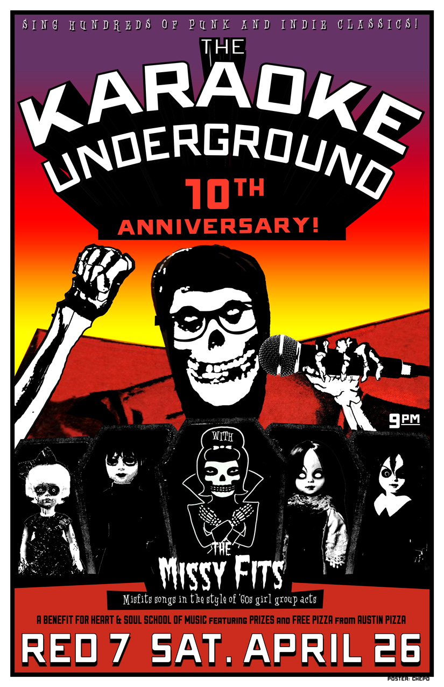

April 26th at 9p\
[Red 7](http://red7austin.com)\
$8 free-will donation to benefit [Heart & Soul School of Music](http://heartandsoulschoolof.wix.com/heartandsoulschool)!\
Free pizza from [Austin’s Pizza](http://austinspizza.com)!\
[The MissyFits](https://www.facebook.com/TheMissyFIts) @ 9! KU co-founder Hannah Ford and four other amazing women perform Misfits songs in the style of ’60s girl group acts. Karaoke starts immediately after The Missyfits!

Raffle tickets will be $1 for 1, $5 for 7, and $10 for an arm’s length (arm in question to be determined by ticket seller). In addition to the prizes below, we’ll have t-shirts, buttons and other merch for sale from KU, The MissyFits and Heart & Soul School of Music!\
A Ladies Rock Camp scholarship from Girls Rock Camp Austin\
A Karaoke Underground house party\
Transmission tickets:\
– Chuck Ragan – 5/5 at Mohawk\
– Trans Am + Survive – 5/31at Red 7\
– The Mountain Goats – 6/22 at Mohawk\
C3 tickets:\
– ONE: The Only Tribute to Metallica – 5/8 at Stubb’s\
– Cheap Trick – 5/16 at Emo’s\
– Jimmy Eat World – 5/18 at Stubb’s\
Gift Basket donated by Novela Jewelry & Accessories\
$30 gift certificate from Jennifer Cunningham’s Etsy store\
$50 gift certificate from Austin’s Pizza\
Hey Cupcake! gift cards\
Karaoke Underground T-shirt\
Tom Tom magazine
