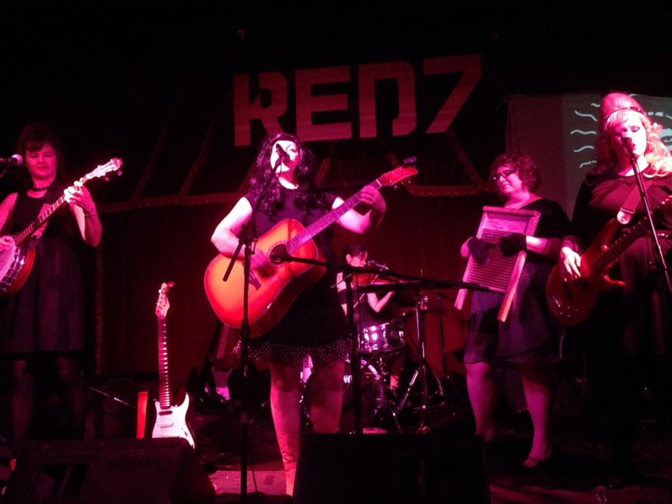
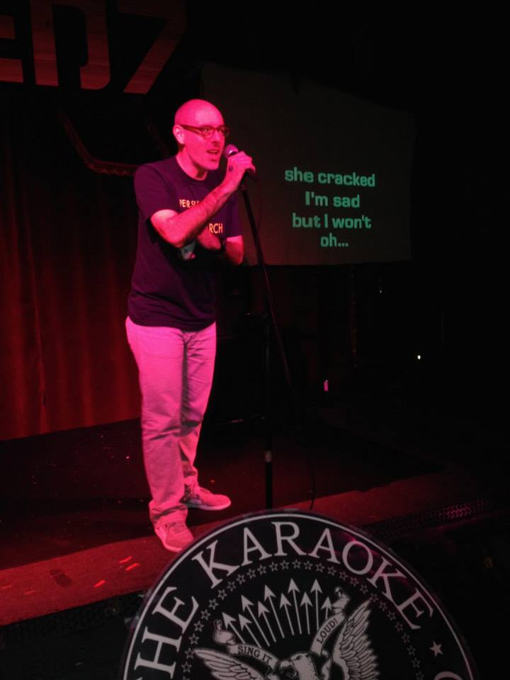
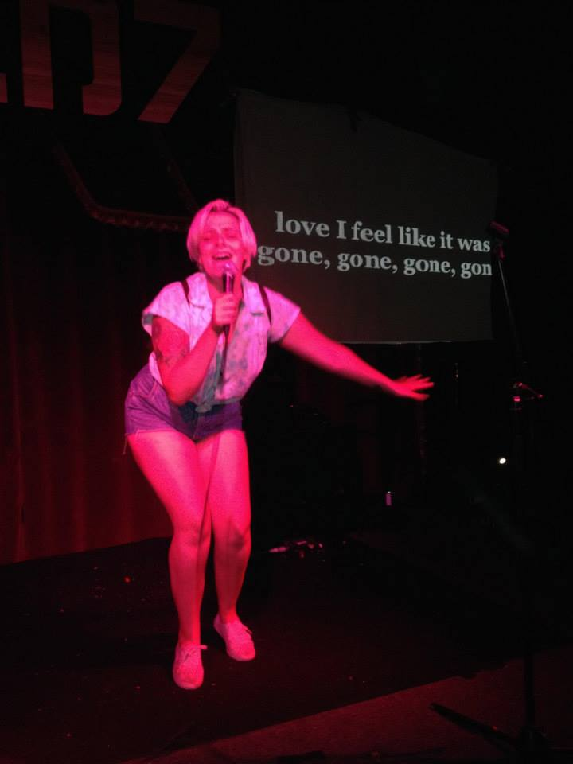
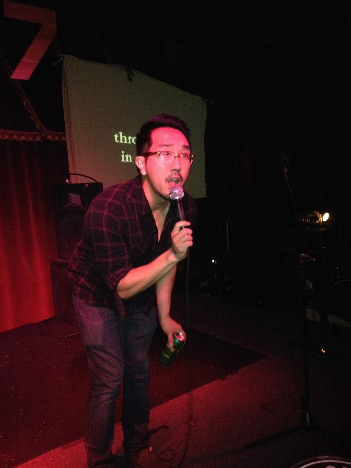

*The Missyfits play “Die Die My Darling” during their opening set.*

*KU patron saint Patrick kicked off the singing. Patrick designed our initial website and DJ’d before shows as The Phonograph Disaster, plus made a couple dozen videos.*

*Alie sings one of her requests!*

*Cliff rocks The Replacements!*

We had a huge turnout and were able to raise over $900 for [Heart & Soul School of Music](http://heartandsoulschoolof.wix.com/heartandsoulschool)! Big thanks to Anjoli and Jamie from Heart & Soul for all their help in coordinating prizes and running the merch table, y’all are amazing!

[The MissyFits](https://www.facebook.com/TheMissyFIts) were incredible, and I can’t wait for them to come back fully charged after Hannah has the baby. See you this Halloween, girls!

Giant thanks to Del and Lindsay from [Austin’s Pizza](http://austinspizza.com) for the gift certificate and truckload of free pizza! Also, couldn’t have done this without the great staff at Red 7, particularly Dutch on sound, all of the prize donations (below) and most importantly ALL OF THE FANTASTIC SINGERS, NEW AND OLD! We love you! It’s been a great ten years and here’s to at least that many more!

Prizes given away from these wonderful folks:\
A Ladies Rock Camp scholarship from Girls Rock Camp Austin\
Transmission tickets:\
– Chuck Ragan – 5/5 at Mohawk\
– Trans Am + Survive – 5/31at Red 7\
– The Mountain Goats – 6/22 at Mohawk\
C3 tickets:\
– ONE: The Only Tribute to Metallica – 5/8 at Stubb’s\
– Cheap Trick – 5/16 at Emo’s\
– Jimmy Eat World – 5/18 at Stubb’s\
Gift Basket donated by Novela Jewelry & Accessories\
$30 gift certificate from Jennifer Cunningham’s Etsy store\
$50 gift certificate from Austin’s Pizza\
Hey Cupcake! gift cards\
Tom Tom magazine
