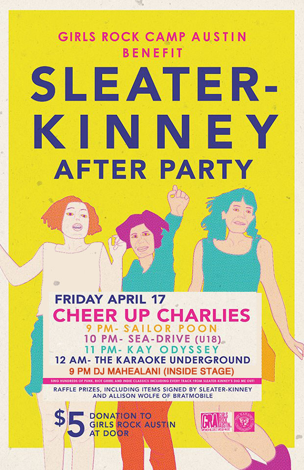

\
Details took a little while to solidify for a couple of these, but proud to announce some fantastic benefit shows in Austin next weekend, plus a reminder that KU will be in California this weekend!

SHOWS\
Saturday, 4/11 @ PRF West Coast BBQ, Elbo Room, San Francisco, CA\
https://www.facebook.com/events/1575767102659296/\
45-minute pre-party set at 1p, bands start at 1:45

Sunday, 4/12, San Francisco, CA @ The Rickshaw Stop\
All night long with American Tripps ping-pong!\
http://www.rickshawstop.com/event/786329-karaoke-underground-san-francisco/\
https://www.facebook.com/events/876958589032873/

Thursday, 4/16 @ Sweetwater, 9p, FREE\
This is my (Kaleb’s) birthday, and it’s also your best chance to sing more than once in Austin this month!\
https://www.facebook.com/events/1481108842168667

Friday, 4/17 @ Cheer Up Charlies, 9p, $5 donation\
Sleater-Kinney afterparty & benefit for Girls Rock Austin!\
https://www.facebook.com/events/770561706374211/\
This is going to be HUGE, with raffle prizes including items signed by Sleater-Kinney and Alison Wolfe of Bratmobile, plus this great lineup of acts with KU!\
Inside\
9pm-12am: DJ Mahealani\
12am-2am: The Karaoke Underground (will start off with every song on Dig Me Out in order!)\
Outside\
9pm: Sailor Poon\
10pm: SEA-DRIVE\
11pm: Kay Odyssey

Saturday, 4/18 @ The Highball, Austin, Free entry, many opportunities to donate\
Benefit for Chepo Peña of Karaoke Apocalypse, Help Chepo Fuck Cancer\
Our good friend Chepo Peña of Karaoke Apocalypse is undergoing treatment for Stage IV Non-Hodgkins Lymphoma. On Saturday, April 18, Karaoke Underground will open up a special Karaoke Apocalypse fundraiser at The Highball to help cover Chepo’s medical costs. Hope you can make it out and have more fun to help a great guy.\
http://thehighball.com/events/detail/27795/\
http://www.gofundme.com/helpchepo\
https://www.facebook.com/events/357817787746765/

Saturday, 5/2 @ Nomad, 10p, FREE\
https://www.facebook.com/events/644529815639332

NEW SONGS!\
The Blind Shake – I’m Not An Animal\
Bright Eyes – Lover I Don’t Have To Love\
FIDLAR – No Waves\
Scratch Acid – This Is Bliss\
Sleater-Kinney – Dance Song ’97\
Marnie Stern – Year Of The Glad\
The Weakerthans – Psalm For The Elks Lodge Last Call
