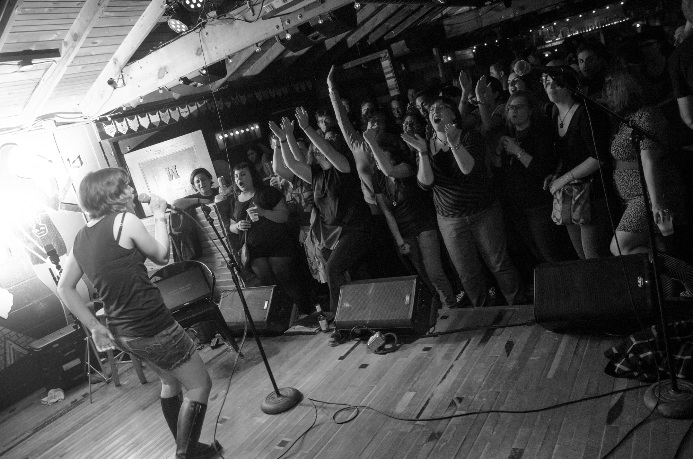

APRIL RULED SO HARD.\
The show at Rickshaw Stop in San Francisco and the Sleater-Kinney Afterparty/Girls Rock Camp Benefit at Cheer Up Charlies in particular were probably the two best shows we’ve done since the Matador 21 shows back in 2010, it was great seeing so many new and old friends at both. Here’s a clip from San Francisco and a still from CUC, hope to see y’all again very soon!

Stage full of badass women singing Rebel Girl in SF

[@rickshawstop #bikinikill #rebelgirl #danceparty](https://instagram.com/p/1aQ_4_yqbd/)

A video posted by KUAustin (@karaokeunderground) on Apr 13, 2015 at 2:39am PDT

Totally rad crowd cheering along with Sleater-Kinney’s Dance Song ’97 during the Dig Me Out karaoke set at Cheer Up Charlies

*photo by Brian Ledden*

SHOWS\
We have a conflict at Sweetwater this month, so won’t be there in May but hope to be back on Third Fridays this summer. KU will be debuting at Drinks Lounge on E. Cesar Chavez at the end of the month, very excited to start there!

[Saturday, 5/2 @ Nomad, 10p, FREE](https://www.facebook.com/events/644529815639332)

[Monday, 5/11 @ Cheer Up Charlies, 10p, FREE\
Monday, 5/25 @ Cheer Up Charlies, 10p, FREE](https://www.facebook.com/events/800514353397906)

[Sunday, 5/31 @ Drinks Lounge, 10p, FREE](https://www.facebook.com/events/1567336350200474/)

MIDWEST TOUR HEADS UP!\
Gonna hit the road with the whole family around a Girls Rock Camp Madison benefit show on Friday, July 17th. Many details TBA, planning to play most/all of DFW, Denton, OKC, KC, Omaha, Sioux Falls, Minneapolis, Madison, Milwaukee, Chicago, Cedar Falls, St. Louis, Memphis and Fayetteville.

NOT KU BUT STILL FUN\
Tomorrow (Friday, May 1st) at Trailer Space Records I’m getting a late birthday present from some of my favorite people in Austin. Most of the bands I’ve played in here are getting together and playing a show all together Everybody’s invited, there will be free beer, plus it’s Trailer Space so BYO. [FB event](https://www.facebook.com/events/897004007031048/)\
\*\*The Nineties – 7:00\
Kaleb solo guitar, silly songs inspired by ’90s bands with dumb names.\
\*\*[Math Patrol](http://mathpatrol.bandcamp.com/) – 7:15\
Fractured soul grooves with hiss, I play bass\
\*\*[Commune EK](https://soundcloud.com/kaleb-asplund/sets/commune-ek) – 8:00\
Motorik and ambient experimental improvisation, I play bass\
\*\*[The Spoils](http://thespoils.bandcamp.com/) – 8:45\
Noisy surf rock, I play guitar\
\*\*[You Make Engine](http://youmakeengine.bandcamp.com/) – 9:15\
Dance-punk, I play bass, Hannah plays keys, we both sing.
