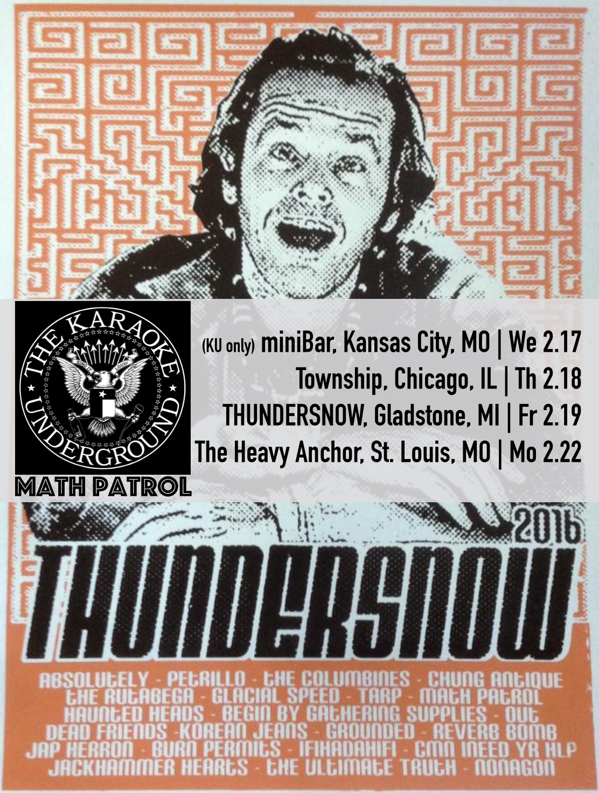

KU returns to the Midwest for THUNDERSNOW 2016, hitting the road with Kaleb’s experimental/noise/soul band [Math Patrol](https://mathpatrol.bandcamp.com/releases) for dates in Kansas City, Chicago, Gladstone, and St. Louis. The Chicago show in particular looks like it’ll be a big night, get there early if you want to sing!

THUNDERSNOW TOUR 2016\
[Wednesday, 2/17 @ miniBar, Kansas City, MO](https://www.facebook.com/events/159835994383185/)\
[Thursday, 2/18 @ Township, Chicago, IL](https://www.facebook.com/events/975226772533979/) with [Math Patrol](https://mathpatrol.bandcamp.com/releases)\
[Friday, 2/19 @ PRF THUNDERSNOW 2016, Gladstone, MI](https://www.facebook.com/events/1676766759207758/) with [Math Patrol](https://mathpatrol.bandcamp.com/releases)\
[Monday, 2/22 @ The Heavy Anchor, St. Louis, MO](https://www.facebook.com/events/573370186150961/) with [Math Patrol](https://mathpatrol.bandcamp.com/releases)
