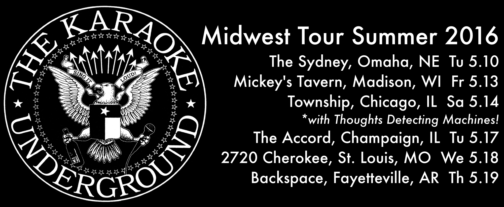

\
After another fun trip to the West Coast in April, we’re hitting the road to the Midwest for what will likely be our most extensive tour of 2016. I’m particularly excited to play with [Thoughts Detecting Machines](http://tedium.us) in Chicago, it’s the solo project of [Poster Children](http://posterchildren.com) singer/guitarist Rick Valentin. TDM opened for KU at a show in Oakland last month and it was an impossibly fun time singing songs by one of my musical heroes and having him there in the same room. Tour dates below!

It’s a fairly busy month in Austin too, four shows including tomorrow night’s First Saturday party at Nomad!
