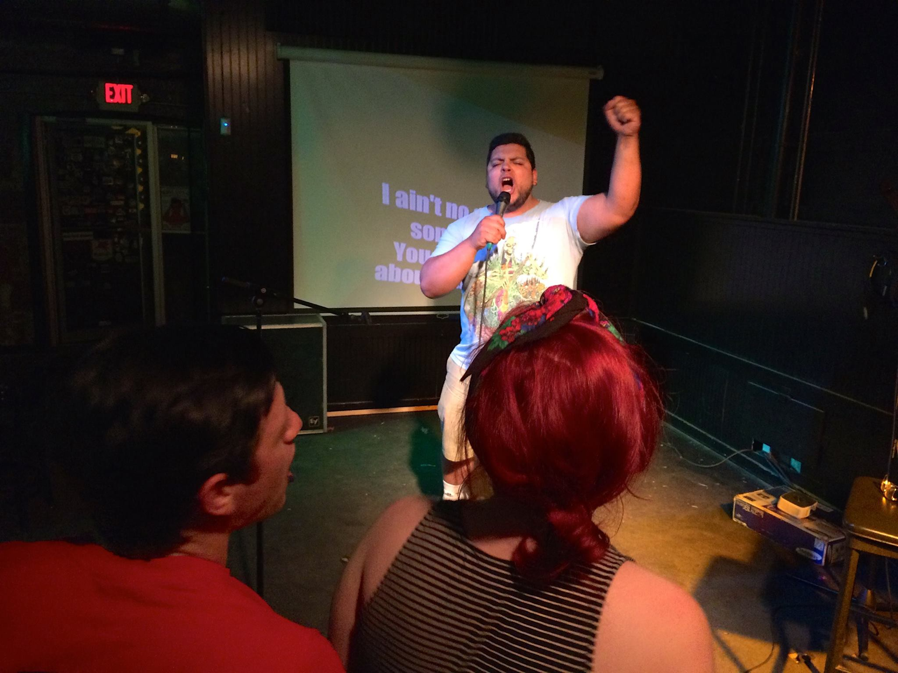
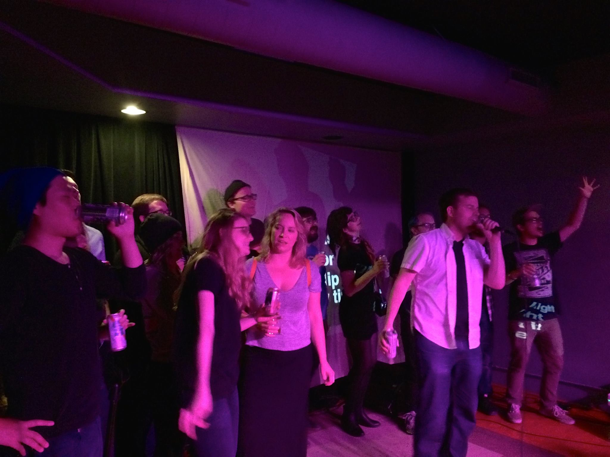
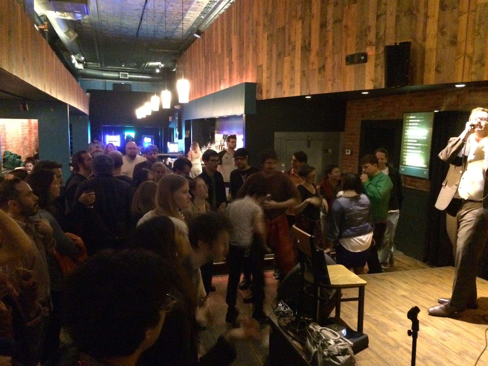
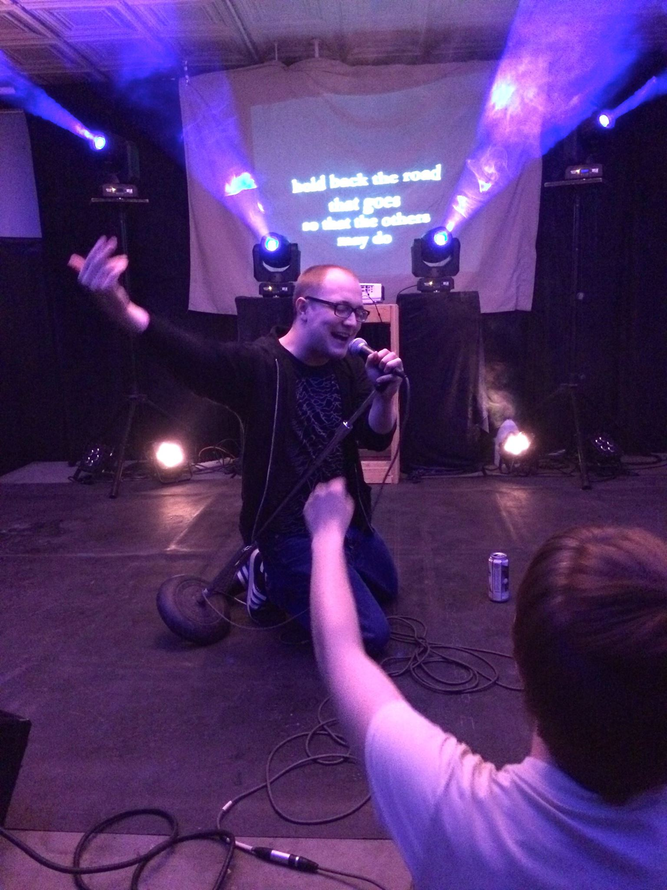
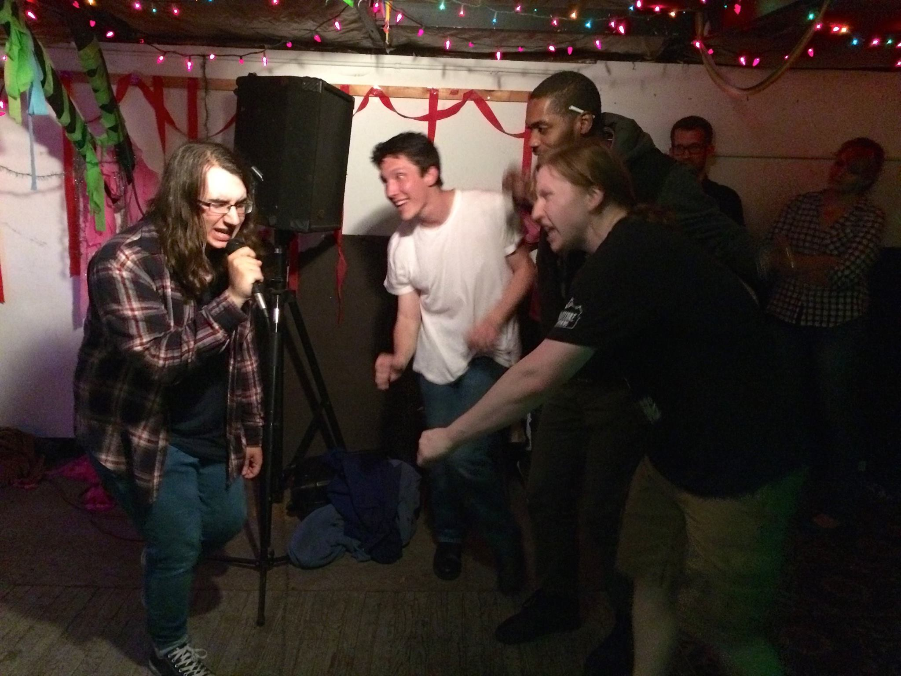

So much fun on this short road trip! Didn’t get to hit a lot of cities as the trip was also organized around spending time with family as my mom recovered from a stroke and my nieces visited from Korea, but there were a ton of great shows…

Omaha @ [The Sydney](http://thesydneybenson.com)\
Thanks to Sam and Chris at [Perpetual Nerves](http://perpetualnerves.com) for booking the show! Great to return to Heather and everybody at The Sydney, a lot of new faces mixed in with the crew who came last summer.\

Madison @ [Mickey’s Tavern](https://www.facebook.com/MickeysTavern/)\
This was probably the 6th time Liz has brought KU to Mickey’s, and it was one of the best, most packed shows yet. So many good friends from all over, wish I could see all of you a lot more often. Thanks again Liz!\

Chicago @ [Township](http://www.townshipchicago.com/) with [Thoughts Detecting Machines](http://tedium.us)\
After February’s great KU show with my band [Math Patrol](https://mathpatrol.bandcamp.com/releases), Steveo asked to have KU back ASAP and it was excellent to be back so soon. I was incredibly excited to have Thoughts Detecting Machines open the show, Rick Valentin’s [Poster Children](http://posterchildren.com) are a massive influence on me personally, and his current solo project is one of the most intriguing guitar/laptop/vocals performances around. Great to see some old and new friends here too!\

Champaign @ [The Accord](http://www.intheaccord.com)\
Incredible Tuesday night crowd! Thanks to Seth, Isaac and Ward for bringing KU to a new venue now that Mike N Molly’s is closing, and to Larry for running sound from the other room all night! Buzz writer Christine put out a [nice preview](http://readbuzz.com/music/2016/karaoke-underground-returns-c-u/) of the show too, that was fun to see.\

St. Louis @ [2720 Cherokee](http://2720cherokee.com)\
Awesome to have three great shows in St. Louis in less than a year! Thanks to Josh for putting it together, great to chat with Carlin after the show and Yvan did an incredible job on sound and lighting all night long.

Fayetteville @ [Backspace](https://www.facebook.com/backspacearts/)\
Wrapped up the shows with this fun DIY spot just off campus in Fayetteville, AR. Thanks to Roger and Laura for putting it together with some comedy from Laura, Zoll and Hansen to open the night! The energy level at this small show was intense!\

